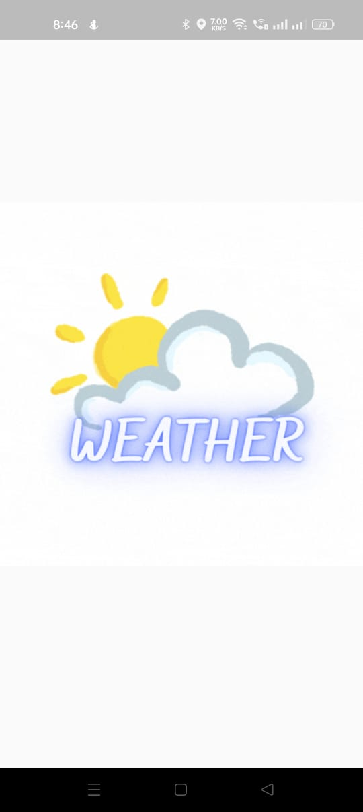
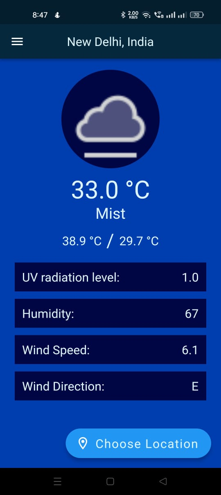
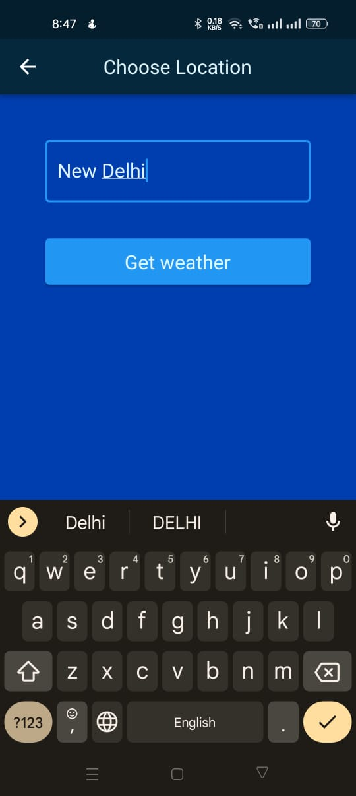
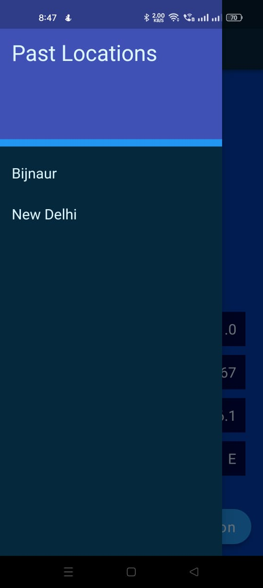

# weather_app

A Flutter project with API calls from WeatherApi.com

## Basic Features

- Get the weather of any city across the globe.
- Uses API from [weatherapi.com](https://www.weatherapi.com/)

## Screenshots

      
